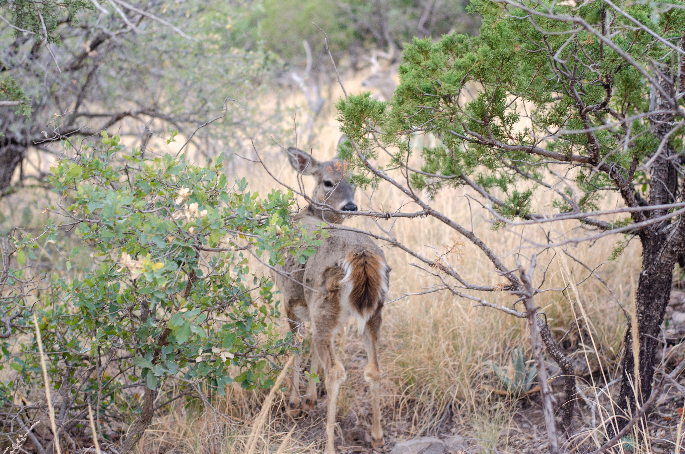
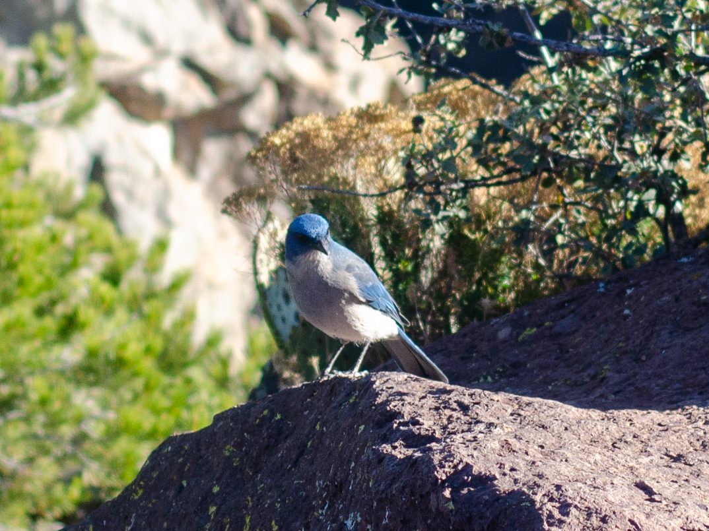
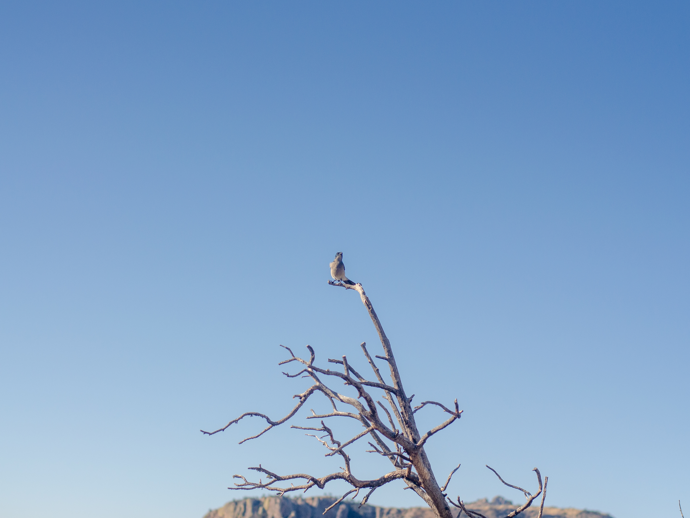

On the main day of our Big Bend trip, we hiked around the Chisos Mountains. This mountain range is located entirely within the boundaries of the park, and its extremely interesting to see the flora and fauna change as you transition from the adjacent Chihuahuan desert into the mountains.

As we started the Lost Mine Trail in the morning, the trail head included lots of signage with warnings of Mountain Lion and Black Bear encounters. So, as we were hiking with my 8-year-old niece, I told her that if she saw an animal while on the trail, the first thing she should do is scream and make a lot of noise. This backfired on me, because as my niece turned a corner on the trail and was met face-to-face with a beautiful Carmen Mountain White-tail deer, she screeched so loudly and scared the ungulates into the brush. They must be pretty used to encountering humans on the trail though, because they actually stuck around and I managed to get a photo of the deer.

{fig-align="center"}

The Carmen Mountain White-tail deer (*Odecoileus virginianus carminis*) are a subspecies of white-tail deer that are found in the Chisos Mountains and nearby Mexican ranges. Upon doing some research for this blog post, it seems they're highly coveted by hunters due to their rarity outside of the Chisos Mountains, which is their main habitat. If you look these guys up on Google, almost every image will be a hunter posing with a dead Carmen Mountain White-tail.

Throughout our hike, we also encountered a lot of Mexican Jays (*Aphelocoma wollweberi)*, which also make their homes in the Chisos Mountains within the park. They look really similar to the California Scrub Jay, which I featured in my last blog post from Point Reyes. Turns out, these birds are all part of the same genus *Aphelocoma*.

{fig-align="center"}
