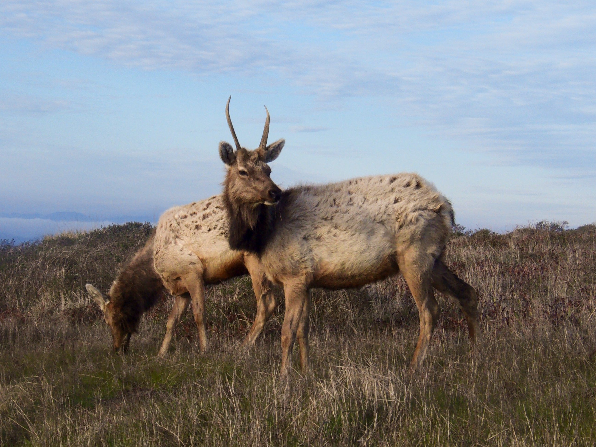
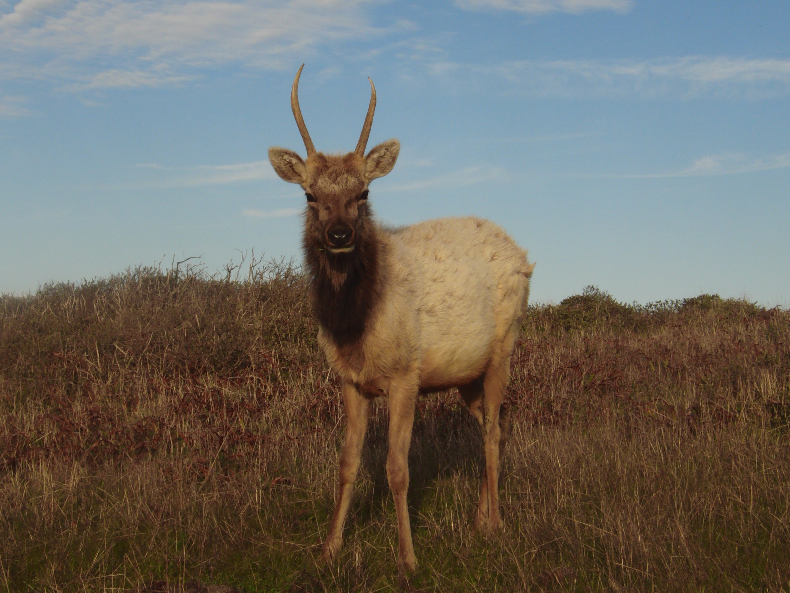
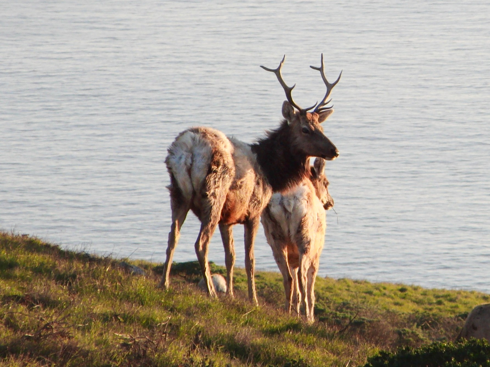
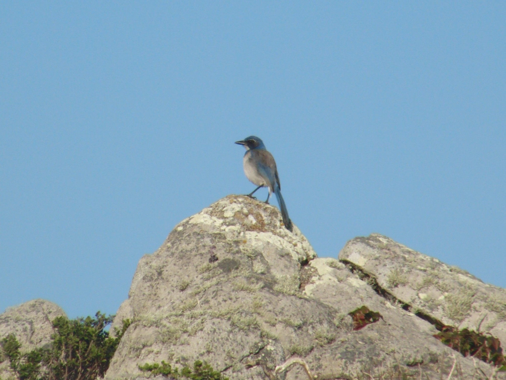

{fig-align="center"}

If you have never ventured up to Tomales Point or the Point Reyes area in general, I would recommend fixing that. This shoreline took my breath away the first time I saw it, and it still does after dozens of visits. My favorite hike in the area is the 9.6 mile Tomales Point Trail, namely because its right in the middle of a Tule Elk Reserve. You are basically guaranteed to encounter a ton of Tule Elk (*Cervus canadensis nannodes*) on this hike, and hey, they might even get pretty close!

{fig-align="center"}

Tule Elk are a subspecies of elk that are actually endemic to California, and they are also the smallest species of elk in North America. The herd that occupies Tomales Point originated from 10 tule elk that were reintroduced to the area in 1978. There's a lot of info on the reintroduction and conservation efforts available on the [NPS website](https://www.nps.gov/pore/learn/nature/tule_elk.htm), which I would recommend looking into if you're interested!

{fig-align="center"}

Some beautiful videos of the elk. In this first one, I was nerding out over the fact that I recognized some of their communication methods from my EVE class (Flehman responses), but I unfortunately did not capture that on video.

::: {style="text-align: center;"}
<iframe width="560" height="315" src="https://www.youtube.com/embed/5B_vqTLcX9A?si=PndF69R5zjc6F0Q8" title="YouTube video player" frameborder="0" allow="accelerometer; autoplay; clipboard-write; encrypted-media; gyroscope; picture-in-picture; web-share" referrerpolicy="strict-origin-when-cross-origin" allowfullscreen>

</iframe>
:::

I did get some video of some proximity signals between these two male elk, who got quite aggressive with each other.

::: {style="text-align: center;"}
<iframe width="560" height="315" src="https://www.youtube.com/embed/mEWwpsPavZA?si=bkF0sy3FBag3KHvA" title="YouTube video player" frameborder="0" allow="accelerometer; autoplay; clipboard-write; encrypted-media; gyroscope; picture-in-picture; web-share" referrerpolicy="strict-origin-when-cross-origin" allowfullscreen>

</iframe>
:::

We also saw a plethora of birds on our hike and throughout the day. My favorite of the day was the Belted Kingfisher that we spotted on the drive up, but I only got a picture of this California Scrub Jay. Still awesome though!! And I felt like a boss when I actually had an answer for a passing hiker who asked me what type of bird it was (not really a flex to ID a California Scrub Jay, but still!).

{fig-align="center"}
